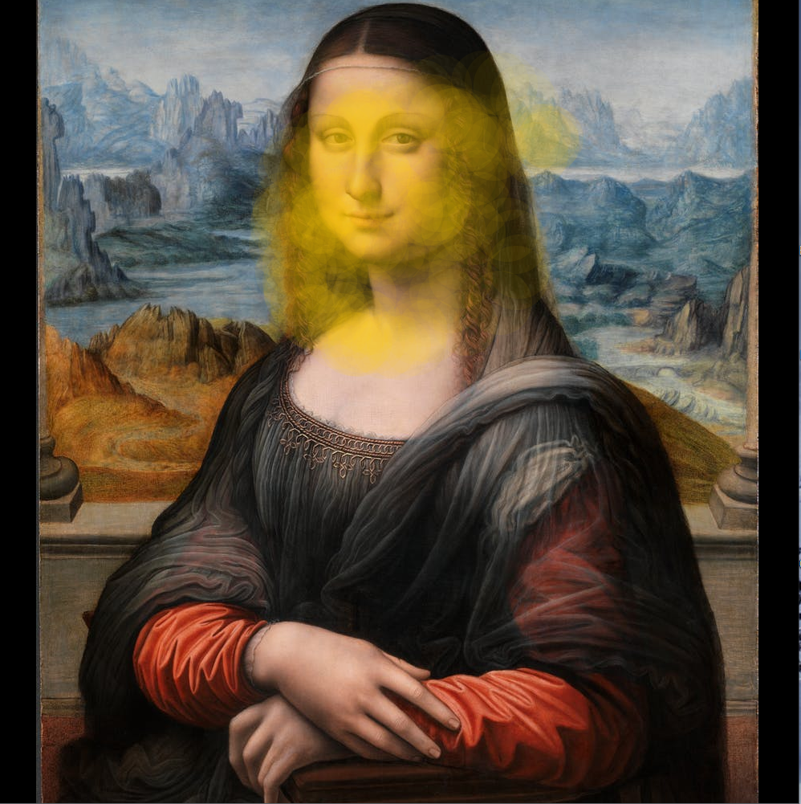
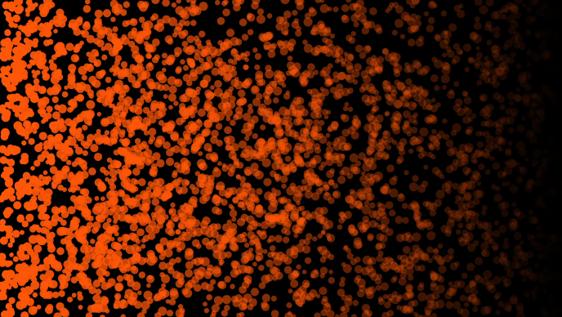
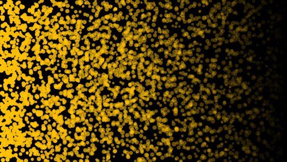
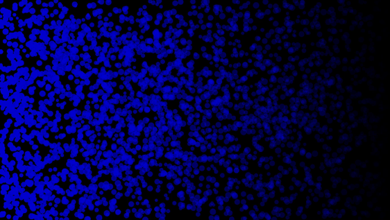
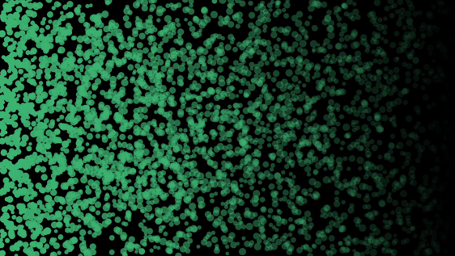

# ROOMOTION
Cured by: Zouzoua Axel Israel BLE, Luca Cattaneo and Giovanni Zanocco
## Introduction
ROOMOTION "Room" + "Emotion" is thought to be an installation.
An immersive and interactive experience in which emotions are recognised 
from the voice of the user and music along with visuals on the screen are 
generated from the captured emotions, creating a whole personal world for the user.

Here are some images of the room. 
central screen: could be any work of art. The user could interact with it by painting on it with his hands




the side walls with the different emotions: the colors mapping to emotions are done following the [Color Theory of J. W. Von Goethe]( https://www.themarginalian.org/2012/08/17/goethe-theory-of-colours/). Also, the movements of the particles change with the emotion 
following the [Arousal/Valence model](https://www.researchgate.net/figure/The-2D-valence-arousal-model-of-emotion-proposed-by-Russel-50_fig1_330861905). 
The considered emotions are: Anger, Happiness, Sadness, and Neutral/Calm.

     

the floor: the user's position in the room is mapped to the center of the sfere, so as the user moves he can see the sphere moving with him on the floor. 
Moreover, as the user speaks, the particles of the sphere brighten creating a shiny effect.

 

## Installation
In order to run the application you must first download and unzip the EMOPIA folder at this [link](https://drive.google.com/drive/folders/1XneQyTCLo9_nMvnhBh8rdnCdmAFoTWcL?usp=sharing). This folder contains all the scripts used for Automatic Music Generation and Speech Emotion Recognition. You can see the networks we started from original repositories: [SER](https://github.com/x4nth055/emotion-recognition-using-speech) and [EMOPIA](https://github.com/annahung31/EMOPIA).
## Requirements
- **The software has been tested using Python 3.8.12 running on Fedora Linux 35**
- **It is recommended to create a Python virtual environment**
### Python Packages
#### SER
- **tensorflow**
- **librosa**
- **numpy**
- **pandas**
- **soundfile**
- **wave**
- **sklearn**
- **tqdm**
- **matplotlib**
- **pyaudio**
#### EMOPIA
- **torch==1.7.0**
- **pytorch-fast-transformers**
- **scikit-learn==0.24.1**
- **seaborn==0.11.1**
- **numpy==1.19.5**
- **miditoolkit==0.1.14**
- **pandas==1.1.5**
- **ipdb**
- **tqdm**
- **matplotlib**
- **scipy**
- **pickle**
- **pygame**
- **python-osc**
- **keyboard**
## Custom Changes
Inside EMOPIA/workspace/transformer/SER/Main.py:
- line 3: os.environ["XDG_RUNTIME_DIR"]="/run/user/1000" is only necessary on Linux systems that use PulseAudio.
- line 152: Change the /bin directory with the location of your Python virtual environment
- line 163/164: Change the hard-coded IP addresses with the addresses of your OSC servers. If you are using different devices you need to be connected to the same network
## How to use it
In order to start the main script you must place yourself inside the EMOPIA/workspace/transformer/SER folder and run the command 
```
$ sudo <your Python venv folder>/ipython Main.py
```
Then, in order to trigger the start of the recording you must hit the spacebar key on your keyboard. After the recording is done, the application will automatically try to recognize its main emotion and generate a short song based on that emotion. The emotion probabilities will be automatically sent to the animations you've opened.
## Animations

Run the animations on Processing. The animations receive OSC messages, therefore if you changed some parameter in python script, check the parameters of the OSC Server. We suggest to use the animations on different displays becuase they run in fullscreen.
In `/animations` we provided also a OSC client that create pseudo-random emotion probabilities and send them on localhost. You can use it in order to test the animations without using the entire script.
